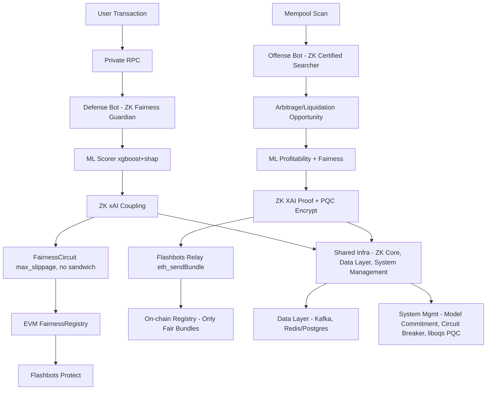
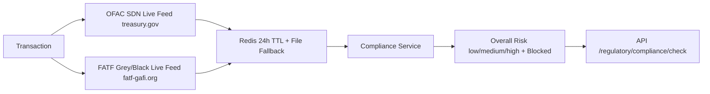
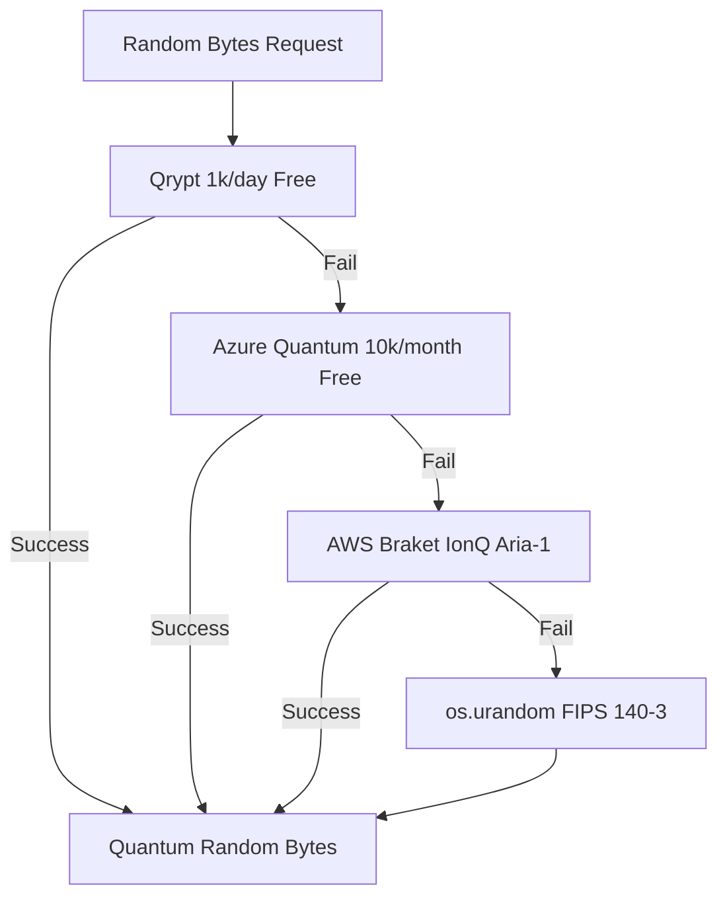
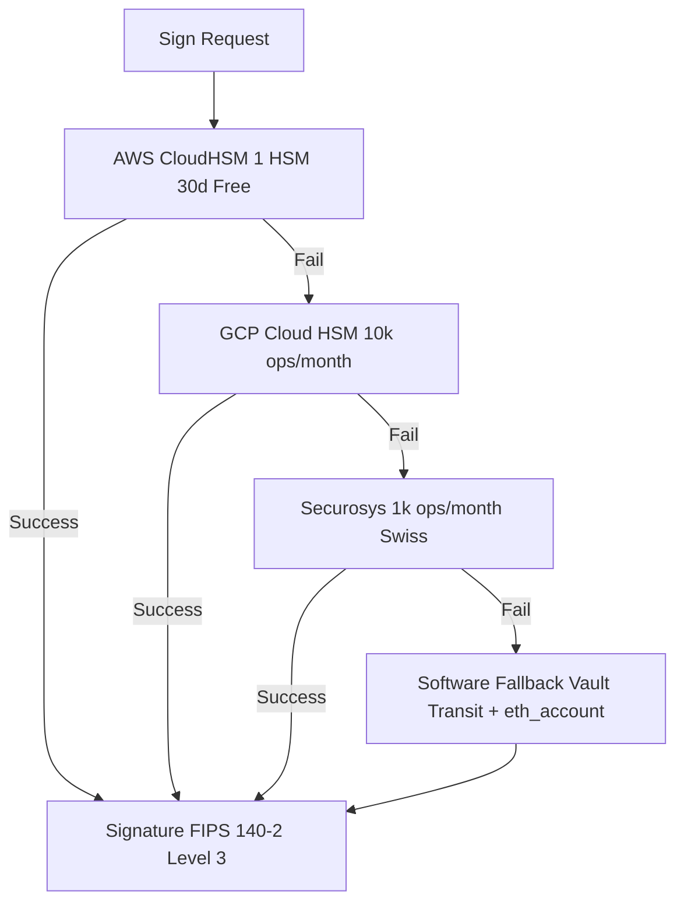
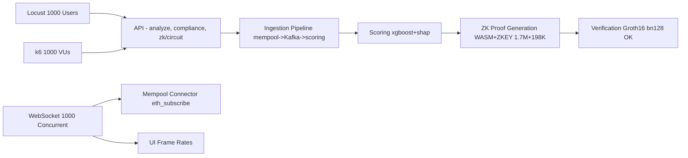
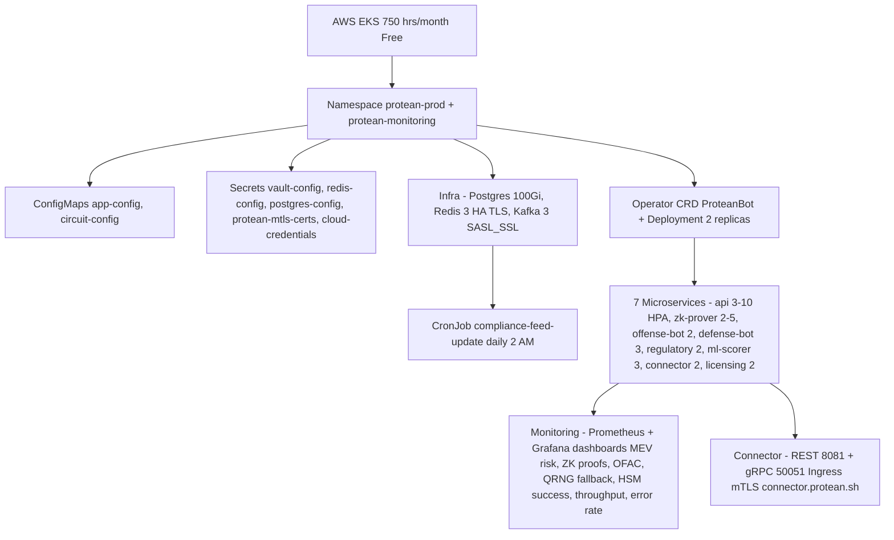
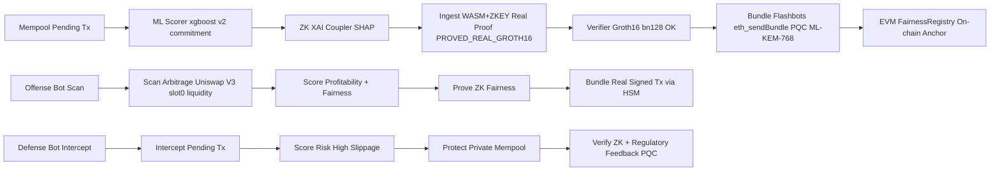
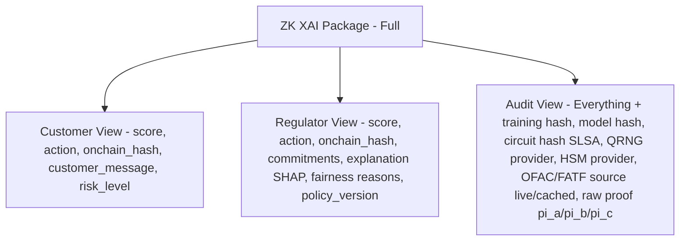

# Diagrams

## System Architecture

```mermaid
graph TB
    UserTx[User Transaction] --> PrivateRPC[Private RPC]
    PrivateRPC --> DefenseBot[Defense Bot - ZK Fairness Guardian]
    DefenseBot --> MLScorer[ML Scorer xgboost+shap]
    MLScorer --> ZKXAI[ZK xAI Coupling]
    ZKXAI --> FairnessCircuit[FairnessCircuit max_slippage, no sandwich]
    FairnessCircuit --> EVMRegistry[EVM FairnessRegistry]
    EVMRegistry --> FlashbotsProtect[Flashbots Protect]

    Mempool[Mempool Scan] --> OffenseBot[Offense Bot - ZK Certified Searcher]
    OffenseBot --> Arbitrage[Arbitrage/Liquidation Opportunity]
    Arbitrage --> MLProfit[ML Profitability + Fairness]
    MLProfit --> ZKXAI2[ZK XAI Proof + PQC Encrypt]
    ZKXAI2 --> FlashbotsRelay[Flashbots Relay eth_sendBundle]
    FlashbotsRelay --> OnChainRegistry[On-chain Registry - Only Fair Bundles]

    ZKXAI --> SharedInfra[Shared Infra - ZK Core, Data Layer, System Management]
    ZKXAI2 --> SharedInfra

    SharedInfra --> DataLayer[Data Layer - Kafka, Redis/Postgres]
    SharedInfra --> SystemMgmt[System Mgmt - Model Commitment, Circuit Breaker, liboqs PQC]
```

## Compliance Flow

```mermaid
graph LR
    Tx[Transaction] --> OFAC[OFAC SDN Live Feed treasury.gov]
    Tx --> FATF[FATF Grey/Black Live Feed fatf-gafi.org]
    OFAC --> Cache[Redis 24h TTL + File Fallback]
    FATF --> Cache
    Cache --> ComplianceService[Compliance Service]
    ComplianceService --> Risk[Overall Risk low/medium/high + Blocked]
    Risk --> API[API /regulatory/compliance/check]
```

## QRNG Flow

```mermaid
graph TB
    Request[Random Bytes Request] --> Qrypt[Qrypt 1k/day Free]
    Qrypt -->|Fail| Azure[Azure Quantum 10k/month Free]
    Azure -->|Fail| AWS[AWS Braket IonQ Aria-1]
    AWS -->|Fail| OsRandom[os.urandom FIPS 140-3]
    Qrypt -->|Success| Result[Quantum Random Bytes]
    Azure -->|Success| Result
    AWS -->|Success| Result
    OsRandom --> Result
```

## HSM Flow

```mermaid
graph TB
    SignRequest[Sign Request] --> AWS[AWS CloudHSM 1 HSM 30d Free]
    AWS -->|Fail| GCP[GCP Cloud HSM 10k ops/month]
    GCP -->|Fail| Securosys[Securosys 1k ops/month Swiss]
    Securosys -->|Fail| Software[Software Fallback Vault Transit + eth_account]
    AWS -->|Success| Signature[Signature FIPS 140-2 Level 3]
    GCP -->|Success| Signature
    Securosys -->|Success| Signature
    Software --> Signature
```

## Load Testing 100k TPS

```mermaid
graph LR
    Locust[Locust 1000 Users] --> API[API - analyze, compliance, zk/circuit]
    K6[k6 1000 VUs] --> API
    API --> Ingestion[Ingestion Pipeline mempool->Kafka->scoring]
    Ingestion --> Scoring[Scoring xgboost+shap]
    Scoring --> ZK[ZK Proof Generation WASM+ZKEY 1.7M+198K]
    ZK --> Verification[Verification Groth16 bn128 OK]
    WebSocket[WebSocket 1000 Concurrent] --> Mempool[Mempool Connector eth_subscribe]
    WebSocket --> UI[UI Frame Rates]
```

## Deployment

```mermaid
graph TB
    EKS[AWS EKS 750 hrs/month Free] --> Namespace[Namespace protean-prod + protean-monitoring]
    Namespace --> ConfigMaps[ConfigMaps app-config, circuit-config]
    Namespace --> Secrets[Secrets vault-config, redis-config, postgres-config, protean-mtls-certs, cloud-credentials]
    Namespace --> Infra[Infra - Postgres 100Gi, Redis 3 HA TLS, Kafka 3 SASL_SSL]
    Infra --> CronJob[CronJob compliance-feed-update daily 2 AM]
    Namespace --> Operator[Operator CRD ProteanBot + Deployment 2 replicas]
    Operator --> Microservices[7 Microservices - api 3-10 HPA, zk-prover 2-5, offense-bot 2, defense-bot 3, regulatory 2, ml-scorer 3, connector 2, licensing 2]
    Microservices --> Monitoring[Monitoring - Prometheus + Grafana dashboards MEV risk, ZK proofs, OFAC, QRNG fallback, HSM success, throughput, error rate]
    Microservices --> Connector[Connector - REST 8081 + gRPC 50051 Ingress mTLS connector.protean.sh]
```

## E2E Pipeline

```mermaid
graph LR
    Mempool[Mempool Pending Tx] --> Scoring[ML Scorer xgboost v2 commitment]
    Scoring --> XAI[ZK XAI Coupler SHAP]
    XAI --> Ingest[Ingest WASM+ZKEY Real Proof PROVED_REAL_GROTH16]
    Ingest --> Verify[Verifier Groth16 bn128 OK]
    Verify --> Bundle[Bundle Flashbots eth_sendBundle PQC ML-KEM-768]
    Bundle --> Registry[EVM FairnessRegistry On-chain Anchor]

    Offense[Offense Bot Scan] --> Scan[Scan Arbitrage Uniswap V3 slot0 liquidity]
    Scan --> ScoreOff[Score Profitability + Fairness]
    ScoreOff --> ProveOff[Prove ZK Fairness]
    ProveOff --> BundleOff[Bundle Real Signed Tx via HSM]

    Defense[Defense Bot Intercept] --> Intercept[Intercept Pending Tx]
    Intercept --> Risk[Score Risk High Slippage]
    Risk --> Protect[Protect Private Mempool]
    Protect --> VerifyDef[Verify ZK + Regulatory Feedback PQC]
```

## Tiered Disclosure

```mermaid
graph TB
    ZKPackage[ZK XAI Package - Full] --> Customer[Customer View - score, action, onchain_hash, customer_message, risk_level]
    ZKPackage --> Regulator[Regulator View - score, action, onchain_hash, commitments, explanation SHAP, fairness reasons, policy_version]
    ZKPackage --> Audit[Audit View - Everything + training hash, model hash, circuit hash SLSA, QRNG provider, HSM provider, OFAC/FATF source live/cached, raw proof pi_a/pi_b/pi_c]
```

